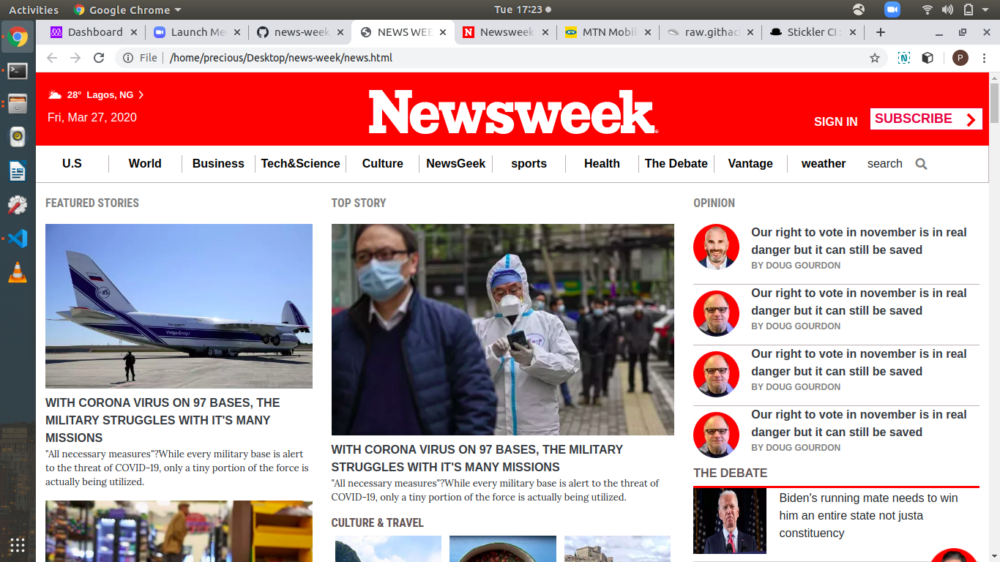

# news-week
news-week-clone
# The next web clone

This is a solo project about building a responsive webpage design

It was done to identify dimension break points and responsiveness with respect to 

different screen sizes.

It is a replica of newsweek.com

Additional description about the project and its features.

# Built With

-HTML & CSS

## Live Demo

[Live Demo Link](https://raw.githack.com/evabanegacom/news-week/master/news.html)

# Prerequisites
Visual Studio code editor

# Authors

👤 **Precious**

- Github: (https://github.com/evabanegacom)
- Linkedin:(https://www.linkedin.com/in/precious-udegbue-a3468314a/)

# 🤝 Contributing
Contributions, issues and feature requests are welcome!

Feel free to check the issues page.

Show your support
Give a ⭐️ if you like this project!

# Acknowledgments

smashing magazine

etc
📝 License
This project is MIT licensed.